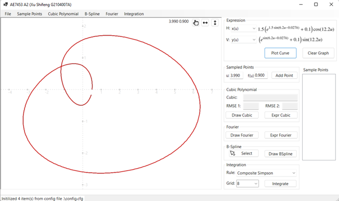
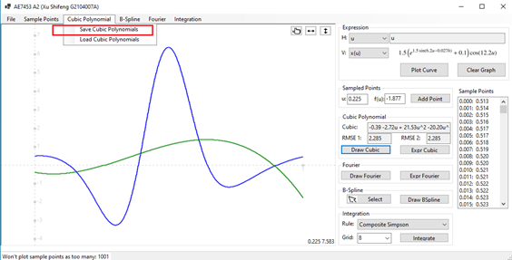
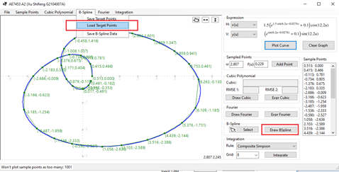
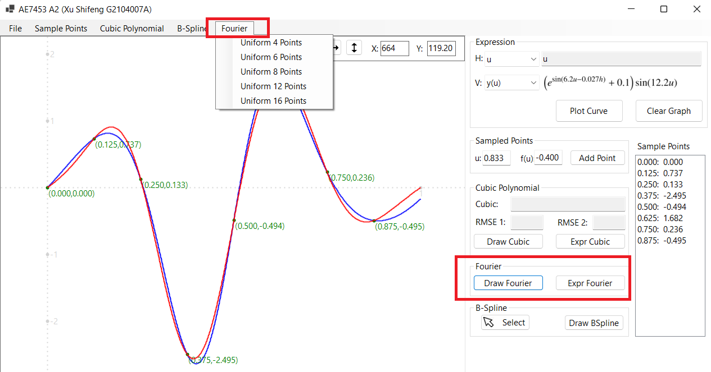
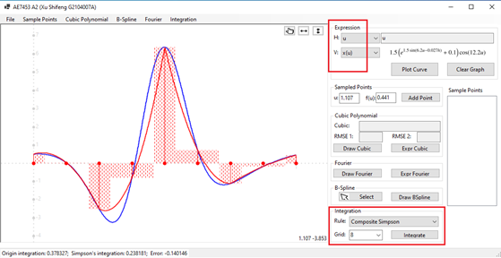
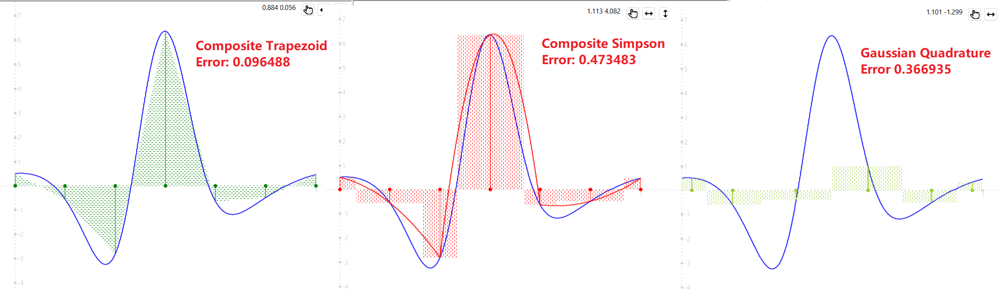
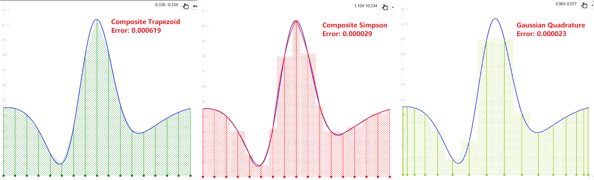

# CE7453-A2
NTU CE7453 Numerical Analysis (2021-2022 Semester 2)

## The required curve

## Cubic Polynomial Interpolation

## B-Spline Interpolation

## Fourier Trigonometric Transformation

## Integrations
We implemented 3 kinds of integration:
* Composite Trapezoid Rule
* Composite Simpson's Rule
* Gaussian Quadrature

### Integration of Simpson

### Integration of all rule with 6 grids

### Integration of all rule with 16 grids

