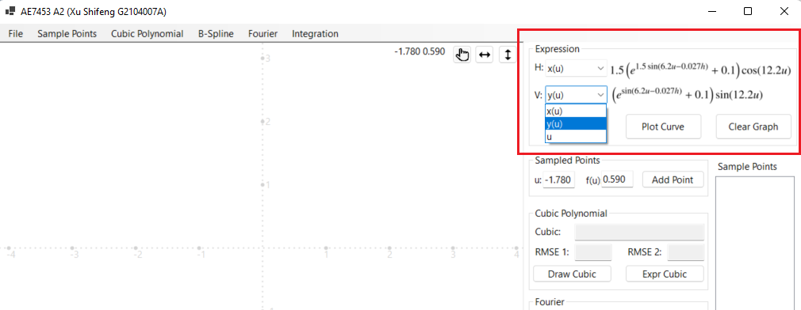
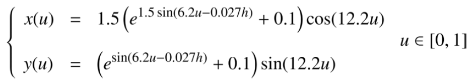
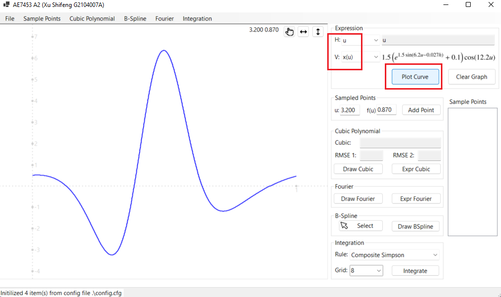

# Tutorial

Once open the UI, we should check the ```Expression``` group box.



It has 2 dropdown list: H and V. "H" means horizontal, just the X-axis on the coordinates; and "V" means vertical, just the Y-axis on the coordinates.

And by default, each dropdown list has 3 items: x(u), y(u) and u. The x(u) and y(u) here are just the expression mentioned in our assignment 2.



Once we choose the "H" and "H" expression, we can click ```Plot Curve``` button to draw the curve. For example, if we choose ```u``` for horizontal, and ```x(u)``` for vertical, we can get such curve below.


